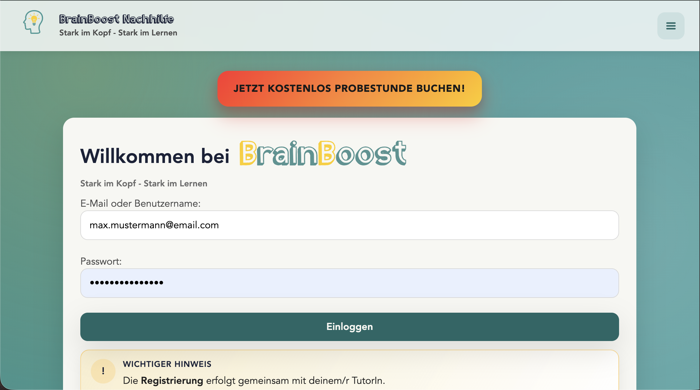
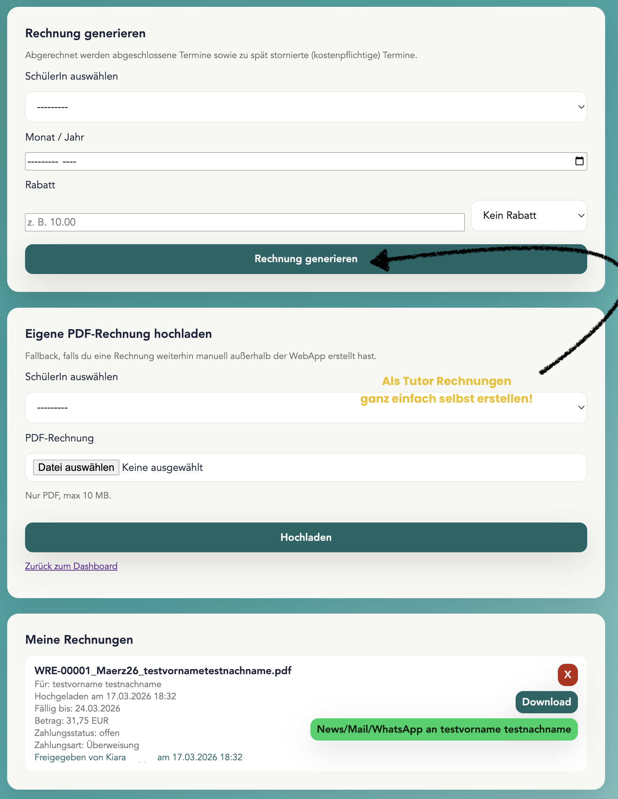
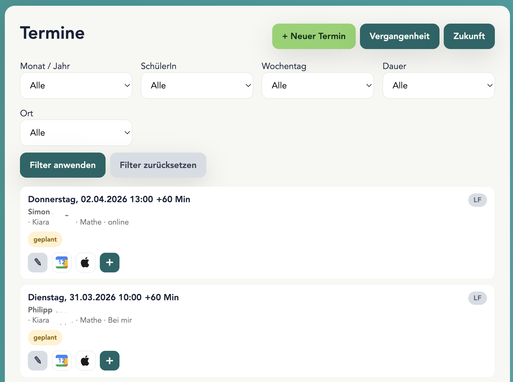

# BrainBoost App

<p align="center">
  
</p>

<p align="center">
  Webplattform fuer Nachhilfe-Organisation mit Rollen, Terminplanung, Lernmaterial, Rechnungsprozess und Stripe-Checkout.
</p>

<p align="center">
  <a href="https://www.nachhilfe-brainboost.de"></a>
  <a href="https://brainboost.pythonanywhere.com"></a>
  
  
</p>

## Produktueberblick

BrainBoost ist eine Django-Anwendung fuer den operativen Alltag eines Nachhilfe-Teams:

- Rollen- und Accountverwaltung fuer Eltern, Schueler:innen, Tutor:innen und Admins
- Termin- und Unterrichtsverwaltung inkl. Aenderung, Absage und Kalender-Export
- Upload von Aufgaben/Loesungen und tutor-spezifischen Vorlagen
- Rechnungsprozess inkl. Freigabe- und Benachrichtigungs-Workflow
- Stripe-Integration (Checkout + Webhook) fuer digitale Zahlungsablaeufe
- E-Mail-Flows fuer Registrierung, Passwort-Reset, Unterrichts-Events und Erinnerungen

## Screenshots (Platzhalter)

> Lege die Dateien z. B. unter `docs/assets/screens/` ab und ersetze die Pfade unten.

### Landing Page


### Dashboard


### Rechnungen & Zahlung


### Tutor:innen Workflow


## Brand Assets (SVG/PNG Platzhalter)

- Logo (SVG): `docs/assets/brand/brainboost-logo.svg`
- Logo (PNG): `docs/assets/brand/brainboost-logo.png`
- OpenGraph Image (PNG): `docs/assets/brand/og-image.png`
- Icon/App Symbol (SVG): `docs/assets/brand/icon.svg`

## Tech Stack

- Python 3.11+
- Django 4.2
- PostgreSQL (lokal + Produktion)
- Stripe API
- WeasyPrint (PDF)
- Pillow, openpyxl, qrcode
- Deployment auf PythonAnywhere

## Projektstruktur

```text
brainboost-app/
├─ brainboost/                  # Django-Projektroot (manage.py liegt hier)
│  ├─ brainboost/               # settings, urls, wsgi/asgi
│  └─ core/                     # App mit Models, Views, Templates, Static
├─ .env.example                 # Beispiel-Konfiguration
├─ requirements.txt
└─ README.md
```

## Quickstart (Lokal)

```bash
# 1) Repository klonen und ins Projekt
git clone <REPO_URL>
cd brainboost-app

# 2) Virtuelle Umgebung
python3 -m venv .venv
source .venv/bin/activate

# 3) Dependencies
pip install -r requirements.txt

# 4) Umgebungsvariablen
cp .env.example .env
# .env mit lokalen Werten anpassen

# 5) Django starten
cd brainboost
python manage.py migrate
python manage.py runserver
```

App lokal: `http://127.0.0.1:8000`

## Wichtige Env-Variablen

Beispielwerte siehe [`.env.example`](.env.example).

- `DJANGO_DEV_SECRET_KEY`
- `DJANGO_SECRET_KEY`
- `POSTGRES_LOCAL_*` / `POSTGRES_*`
- `EMAIL_HOST_USER`, `EMAIL_HOST_PASSWORD`
- `STRIPE_PUBLIC_KEY`, `STRIPE_SECRET_KEY`, `STRIPE_WEBHOOK_SECRET`
- `APP_BASE_URL`

## Deployment (PythonAnywhere)

Typischer Ablauf fuer `staging`:

```bash
git pull --ff-only origin staging
python manage.py migrate
python manage.py collectstatic --noinput
```

Danach Web-App in PythonAnywhere neu laden.

## Security-Hinweise

- Keine Secrets in Git committen (`.env`, Credentials, API Keys).
- Keine lokalen Dumps/Uploads versionieren (`*.sql`, `media/`, lokale Exporte).
- Bei versehentlich geleakten Secrets: sofort rotieren.

## Roadmap (Platzhalter)

- [ ] Testabdeckung ausbauen (Unit + Integration)
- [ ] CI-Pipeline fuer Linting/Tests
- [ ] Monitoring/Alerting fuer Zahlungs- und E-Mail-Flows
- [ ] Verbesserte Admin-Reports

## Lizenz

Platzhalter: `MIT` (oder eure gewuenschte Lizenz eintragen).

