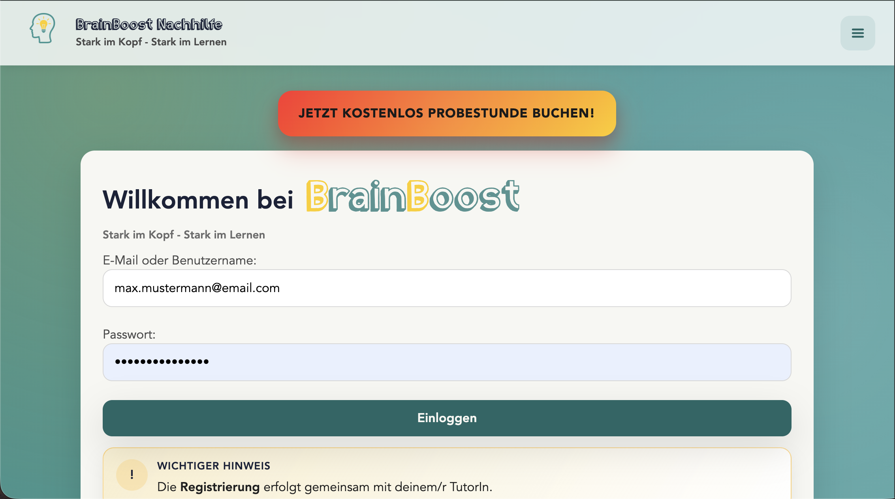
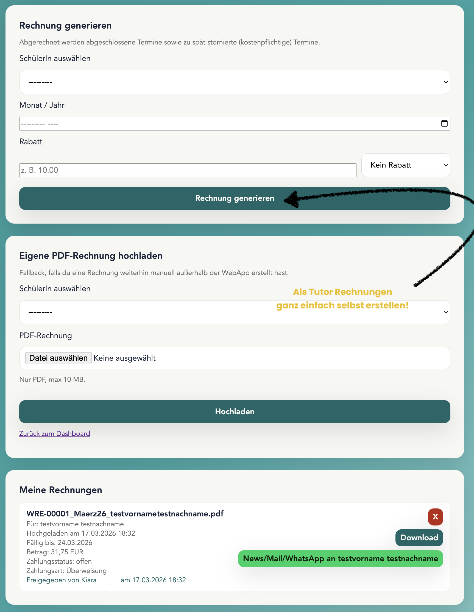
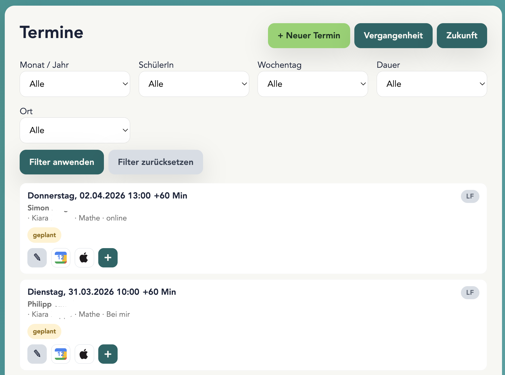

# BrainBoost App

<p align="center">
  
</p>

<p align="center">
  Webplattform fuer Nachhilfe-Organisation mit Rollen, Terminplanung, Lernmaterial, Rechnungsprozess und Stripe-Checkout.
</p>

<p align="center">
  <a href="https://www.nachhilfe-brainboost.de"></a>
  <a href="https://brainboost.pythonanywhere.com"></a>
  <a href="https://github.com/smigalski/brainboost-app/actions/workflows/ci.yml"></a>
  
  
</p>

## Produktueberblick

BrainBoost ist eine Django-Anwendung fuer den operativen Alltag eines Nachhilfe-Teams:

- Rollen- und Accountverwaltung fuer Eltern, Schueler:innen, Tutor:innen und Admins
- Termin- und Unterrichtsverwaltung inkl. Aenderung, Absage und Kalender-Export
- Upload von Aufgaben/Loesungen und tutor-spezifischen Vorlagen
- Rechnungsprozess inkl. Freigabe- und Benachrichtigungs-Workflow
- Stripe-Integration (Checkout + Webhook) fuer digitale Zahlungsablaeufe
- E-Mail-Flows fuer Registrierung, Passwort-Reset, Unterrichts-Events und Erinnerungen

## Screenshots

> Die Screenshots sind prod-reif und kommen aus einer realen online-Umgebung.

### Landing Page


### Dashboard


### Rechnungen & Zahlung


### Tutor:innen Workflow


## Brand Assets

- Logo (SVG): `docs/assets/brand/brainboost-logo.svg`
- Logo (PNG): `docs/assets/brand/brainboost-logo.png`
- OpenGraph Image (PNG): `docs/assets/brand/og-image.png`
- Icon/App Symbol (SVG): `docs/assets/brand/icon.svg`

## Tech Stack

- Python 3.13 (lokaler Patchstand in `.python-version`)
- Django 6.1.1 (aktuelle stabile Version am 28.09.2026)
- PostgreSQL 16 (lokal + Produktion)
- Stripe API
- WeasyPrint (PDF)
- Pillow, openpyxl, qrcode
- Deployment auf PythonAnywhere

## Projektstruktur

```text
brainboost-app/
├─ brainboost/                  # Django-Projektroot (manage.py liegt hier)
│  ├─ brainboost/               # settings, urls, wsgi/asgi
│  └─ core/                     # App mit Models, Views, Templates, Static
├─ .env.example                 # Beispiel-Konfiguration
├─ requirements.txt
└─ README.md
```

## Quickstart (Lokal)

```bash
# 1) Repository klonen und ins Projekt
git clone <REPO_URL>
cd brainboost-app

# 2) Virtuelle Umgebung
# Bei einem Python-Wechsel eine neue venv erstellen, die alte vorher sichern.
python3.13 -m venv .venv
source .venv/bin/activate

# 3) Dependencies
python -m pip install -r requirements.txt
python -m pip check

# 4) Umgebungsvariablen
cp .env.example .env
# .env mit lokalen Werten anpassen

# 5) Django starten
cd brainboost
python manage.py migrate
python manage.py runserver
```

App lokal: `http://127.0.0.1:8000`

PostgreSQL 16 muss laufen und Datenbank/User müssen zu `POSTGRES_LOCAL_*`
passen. Auf macOS können die Systemabhängigkeiten mit
`brew install python@3.13 postgresql@16 pango` und
`brew services start postgresql@16` eingerichtet werden. Vorhandene Datenbanken
bei einem Major-Upgrade zuerst sichern; ein neues PostgreSQL-Paket übernimmt
keinen alten Datenbestand automatisch.

Nach dem Wechsel von Python 3.9 ein neues Terminal öffnen oder die Umgebung
erneut aktivieren. In VS Code den Interpreter `.venv/bin/python` auswählen.
`python --version` muss 3.13 anzeigen.

Prüfungen aus dem Repository-Root:

```bash
python brainboost/manage.py check
python brainboost/manage.py makemigrations --check --dry-run
python brainboost/manage.py test core --noinput
```

## Wichtige Env-Variablen

Beispielwerte siehe [`.env.example`](.env.example).

- `DJANGO_DEV_SECRET_KEY`
- `DJANGO_SECRET_KEY`
- `POSTGRES_LOCAL_*` / `POSTGRES_*`
- `PUBLIC_CONTACT_EMAIL`: öffentliche Kontaktadresse, aktuell `brainboost.nachhilfe@gmail.com`
- `INTERNAL_CONTACT_EMAIL`: interne Fallback-Adresse, aktuell `brainboost.nachhilfe@gmail.com`
- `EMAIL_HOST`, `EMAIL_PORT`, `EMAIL_USE_TLS`, `EMAIL_HOST_USER`, `EMAIL_HOST_PASSWORD`: SMTP-Zugangsdaten, in Produktion ohne Passwort im Repo
- `EMAIL_BACKEND`: optionaler Backend-Pfad (Standard: SMTP). Diese Env-Variablen
  werden in Django 6.1 auf `MAILERS["default"]` abgebildet; bestehende `.env`- und
  PythonAnywhere-Werte können unverändert bleiben. Für lokale Mail-Vorschauen
  `django.core.mail.backends.console.EmailBackend` verwenden.
- `DEFAULT_FROM_EMAIL`, `SERVER_EMAIL`, `DEFAULT_REPLY_TO_EMAIL`: Absender-/Antwortadressen für Systemmails
- `EMAIL_RECIPIENT` / `LEAD_NOTIFICATION_EMAIL`: Empfänger für Kontaktformular-/Lead-Benachrichtigungen; kann intern weiter auf Gmail zeigen
- `STRIPE_PUBLIC_KEY`, `STRIPE_SECRET_KEY`, `STRIPE_WEBHOOK_SECRET`
- `APP_BASE_URL`

## Deployment (PythonAnywhere)

Die erstmalige Umstellung von Python 3.9/Django 4.2 auf den neuen Stack ist in
[deploy/README.md](deploy/README.md) beschrieben, inklusive Backup, neuer venv,
Versionsprüfung und Rückweg.

Für spätere Updates nach der Umstellung (im Repository-Root und mit aktivierter
Python-3.13-venv):

```bash
git pull --ff-only origin staging #oder einfach git pull, wenn remote gesetzt ist
python -m pip install -r requirements.txt
python -m pip check
export DJANGO_SETTINGS_MODULE=brainboost.settings.production
python brainboost/manage.py check
python brainboost/manage.py migrate
python brainboost/manage.py collectstatic --noinput
```

Danach Web-App in PythonAnywhere neu laden.

PythonAnywhere muss für diese Version mit Python 3.13 und PostgreSQL 16 laufen.
Web-App, virtuelle Umgebung und Tasks müssen dieselbe Python-Version verwenden.

## Continuous Integration

GitHub Actions fuehrt bei jedem Push, Pull Request und manuellen Start den Workflow
`.github/workflows/ci.yml` aus. Der Workflow verwendet Python 3.13 und PostgreSQL 16,
prüft die Python-Abhängigkeiten, Django, fehlende Migrationen und PDF-Erzeugung und führt
`python brainboost/manage.py test core` aus.

## Security-Hinweise

- Keine Secrets in Git committen (`.env`, Credentials, API Keys).
- Keine lokalen Dumps/Uploads versionieren (`*.sql`, `media/`, lokale Exporte).
- Bei versehentlich geleakten Secrets: sofort rotieren.

## Roadmap

- [ ] Testabdeckung ausbauen (Unit + Integration)
- [x] CI-Pipeline fuer Django-Checks und Tests
- [ ] Monitoring/Alerting fuer Zahlungs- und E-Mail-Flows
- [ ] Verbesserte Admin-Reports

## Lizenz

Copyright © 2025-2026 BrainBoost Nachhilfe. Alle Rechte vorbehalten.
